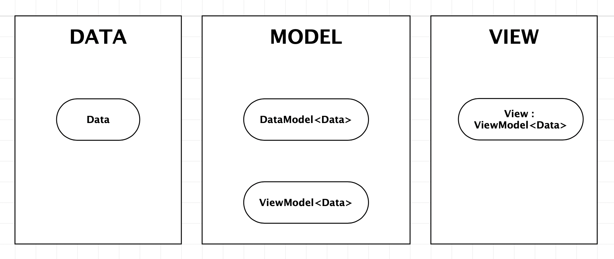

KUU DATA BIND
============

ABOUT
------------
This package contains a data binding system.  
It depends on the Utils package.  

SETUP
------------
Add this package to your project with the Package Manager by giving it this git url. Unity will try to download the package using git. 
Depending on your machine you may have to run additional commands to make sure Unity has the permission to do it:
 > **OSX**
 > ```  
 > ssh-add
 > ```  

FEATURES
============

DDMVM(V)
------------




This data binding framework is tailored for Unity's MonoBehaviours.  
It is based on the premise that anything can be data by adding data bind attributes to fields.
Primitive types dont need attributes but obviously wont have child data fields either.  

There are three key components to this system:  
- Data  
- DataModel  
- ViewModel  

The system utilizes Attributes, Generics and Reflection. Both DataModel and ViewModel are template classes with the Data type as the template argument. Additionally the ViewModel derives from MonoBehaviour so it is a component that should be attached on a game object.


Data
------------
So the data can be any type (primitive, struct or class) and does not have to be marked with any attributes either. Only if the data contains child data then those fields should be marked with the binding attribute: ```[DataBind]```   

Example:  
```
class Data {
	[DataBind] string TextA;
	[DataBind] string TextB;
}
```
Example with nested data:  
```
class DataA {
	[DataBind] string Text;
	[DataBind] DataB B;
}
class DataB {
	[DataBind] string Text;
}
```

Since the system pulls the binding information trough reflection, there is really no limits or requirements on how the data object should be constructed. It can contain methods, it can have its own purposes beyond the data binding. If fact any existing class can be easible made bindable simply by adding the binding attributes to those fields that you want to expose.  

The fields that are bound do not have to be public, since reflection can pull out all fields including the private ones.

DataModel< Data >
------------

The DataModel for data type Data, is DataModel< Data >. When the model is built (happens automatically) it will populate an inner map with data models matching the fields in the Data object.  
How the DataModel for Data looks internally (pseudocode):
```
class Data {
	[DataBind] string A;
	[DataBind] int B;
	float C;
}

class DataModel<Data> {
	Dictionary<string,DataModel> Map;
	Map["A"] = DataModel<string>;
	Map["B] = DataModel<int>;
}
```
So this, what is automatically set up inside the DataModels, is already enough to bind it all the way to the views. If the user wants to access those child models at runtime, it can be done like this:  
```
DataModel<Data> myModel;
DataModel modelA = myModel.Find("A");
DataModel modelB = myModel.Find("B");

// Or with generics...

DataModel<string> modelA = myModel.Find<string>("A");
DataModel<int> modelB = myModel.Find<int>("B");

modelA.Value = "Hello!";
modelB.Value = 1;
```
When you want to access some models in code, it becomes burdensome to fetch each time. To improve that you can (and probably always should) extend your data models, and add properties that become automatically populated with the underlaying models. The properties need to have the setter (but it can remain private), the getter can have whatever scope the programmer wants, the binding system does not use it.
```
class MyDataModel : DataModel<Data> {
	[PropertyBind] public DataModel<string> A { get; private set; }
	[PropertyBind] public DataModel<int> B { get; private set; }
}
```
With this custom model class the above example becomes cleaner:  
```
MyDataModel myModel;
myModel.A.Value = "Hello!";
myModel.B.Value = 1;
```
You dont necessaryly need to add the properties for each and every data field from the start, you can add them incrementally as you discover what parts of the data your logic needs to modify.  

The custom model classes also become a tempting place to move your logic into, leaving the data just as pure data classes or structs without logic. There is not necessarily any benefit in doing so, other than the architectural impact it makes. There are multiple different patterns on how the model classes can be set (will be listed later).  

ViewModel< Data >
------------
The view models can be considered the leaves of this system, the shrouds that the data can vest itself in, or the Avatars of the Data.  
The main purpose of the ViewModel is to create a visual representation of the data that it has been bound with. Although it does not need to be visual, it could be audio, or some other representation.  
You will probably end up with a lot of custom view models extending from same base view model, each representing (or modifying) the data differently.  

You will also have to create a custom view model (in its own script) for each that you intend to attach on a game object (just normal Unity MonoBehaviour workflow). For more complex view models it is advised that you build up one "final" view model that each concrete View implementation inherits from.  
This is also a good point in making the terminology clearer:  
> *Whenever we talk about ViewModels we talk about the generic model classes and when talking about Views we talk about the final concrete classes that can be attached to game objects.*

Example using the Data Model from above:  
```
public class MyView : ViewModel<Data> {
	[ViewBind] [SerializeField] ViewModel<string> A;
	[ViewBind] [SerializeField] ViewModel<int> B;
}
```
> This is the bare minimum view implementation. It allows all the child views (A and B) to respond to changes in Data. Those (child views) have to be assigned in the inspector, and serialized in the scene or a prefab.   
> When defined in its own script this can be attached to a game object.  

Now assuming that you would want to write code in the view class that access the data of the bound model, with the view class as defined above you would need to still use the *Find* method to access them. That is because the view class defined as such, has no notion of the custom model class with the properties. *The underlaying data model is actually of the currect type, with all the properties, but the view only know that its of type DataModel< Data >.*
```
// ... in some method of the view class
this.DataModel.Find("A").SetValue("Bye!");
// or
DataModel<string> A = this.DataModel.Find<string>("A");
A.SetValue("Bye!");
```
But if we instead define the view class as such:
```
public class MyView : ViewModel<Data,MyDataModel> {
```
> By adding the type of the data model we are using we gain access to the properties.
> Also, ```ViewModel<Data>``` is actually just a shorthand for ```ViewModel<Data, DataModel<Data>>```. Which might be helpful to understand.

The same script example would then become:
```
// ... in some method of the view class
this.DataModel.A.SetValue("Bye!");
```

Important Considerations
------------
**Data Authority**
*Should I modify the underlaying Data, or the Data Model?*  
> - The system does not poll for changes in the underlaying fields of the data object, obviously for performance reasons. It can though, trough a call to *Reload*, read the underlaying field again. Similarly with a call to *Flush* it will write into the field of the data object.  
> - So it can be said that by default, the field is read only once and never written into. A call to *Flush* should be made for example before serializing the data object. A call on the top level is sufficient because the *Flush* and *Reload* calls are recursive.  
> - There is a way to turn on write synch to field in the binding attribute: ```[DataBind(true)]```. This will write into the field on every write into data model. Reading still requires *Reload*.   
> - With these things in mind you should make your own decision on where "data authority" resides at in runtime.  
> - If you are retrofitting this to an existiong project or only in a small portion of it, maybe keep the authority where it used to be (the data objects). The drawback is that you will need to make calls to *Reload* whenever necessary. 
> - By moving authority into the data models you get all the benefits of this system without any additional hassle, you just need to *Flush* when necessary if you have systems that read the data objects directly (like serialization).  

ADDITIONAL FEATURES
============

List View Models (Spawners)
------------
In case of the data being a list of something, then instead of using a view model of that same list type, instead use a list view model of the type:  
```
List<string> messages;
DataModel<List<string>> messagesDataModel;
ListViewModel<string> messagesViewModel;
```  

Defining the class for the ListViewModel requires one additional parameter, the concrete view model type that it should spawn, which determines what prefabs can be assigned to its inspector slot:  
```
public class MessagesViewModel : ListViewModel<string,DataModel<string>,MessageViewModel> {}

public class MessageViewModel : ViewModel<string> {} // the view model for a message

```

So a concrete script example would be:   
```
/// DATA
public class Inbox {
	[DataBind] List<string> Messages;
}

/// DATA MODEL
public class InboxModel : DataModel<Inbox> {
	[PropertyBind] public DataModel<List<string>> Messages { get; private set; }
}

/// VIEW MODEL
public class MessageView : ViewModel<string> {}
public class MessageListView : ListViewModel<string,DataModel<string>,MessageView> {}

public class InboxView : ViewModel<Inbox> {
	[ViewBind] MessageListView Messages;
}


```

Property Inherit Attribute
------------
The property inherit attribute allows a data model to reference parent data. This allows child data and view hierachies to respond (and modify) that parent data. This is especially useful when the data contains lists, where something meaningful for the context cannot (or preferred not) be stored within the instance in question.  

Script Example:  
```
/// DATA
public enum FireMode { Safety, Single, FullAuto }

public class WeaponAction { 
	protected virtual FireMode Mode => FireMode.Safety;
}
public class SafetyAction : WeaponAction {}
public class SingleAction : WeaponAction {
	protected override FireMode Mode => FireMode.Single;
}
public class FullAutoAction : WeaponAction {
	protected override FireMode Mode => FireMode.FullAuto;
}

public class Weapon {
	[DataBind] public FireMode CurrentMode;
	[DataBind] public List<WeaponAction> Actions;
}

/// DATA MODEL

public class WeaponModel : DataModel<Weapon> {
	[PropertyBind] public DataModel<FireMode> CurrentMode { get; private set; }
	[PropertyBind] public DataModel<List<WeaponAction>> Actions { get; private set; }
}

public class WeaponActionModel : DataModel<WeaponAction> {
	[PropertyInherit] public DataModel<FireMode> CurrentMode { get; private set; }
}

/// VIEW MODEL

public class WeaponActionView : ViewModel<WeaponAction,WeaponActionModel> {

	[BindAction("CurrentMode")]
	private void OnSetMode(FireMode mode) {
		this.enable = this.DataModel.Mode.Value == mode;
	}
}


```

Bind Action Attribute
------------
Allows methods with matching signature to be bound to data:   
```
/// DATA
public class Data {
	publis string Message;
}

// VIEW
[BindAction("Message")]
private void OnMessageChanged(string text) {
	this.messageTextField.text = text;
}
```

Bind Button Attribute
------------
Allows boolean data to be bound to a button in a most convenient way. When the button is pressed the underlaying data is set to true and the button stays in pressed mode untill the data is set to false.  
Example:   
```
/// DATA
public class Data {
	publis bool Execute;
}

// VIEW
[BindButton("Execute")]
public Button executeButton;
```

Data Context Map
------------
Sometimes there may not be a convenient way to bind data to view. For those situations data can register into the data context map, from where views can try to find data to bind with.  

Example:  
```
/// DATA
public class Settings {}
public class SettingsModel : DataModel<Settings> {}

private static SettingsModel settings;
void Init() {
	settings = new SettingsModel();
	DataContextMap.Put("Settings", settings);
}

/// VIEW
public class SettingsView : ViewModel<Settings> {

	protected override void Start() {
		this.BindData(DataContextMap.Find<SettingsModel>("Settings"));
	}
}
```


